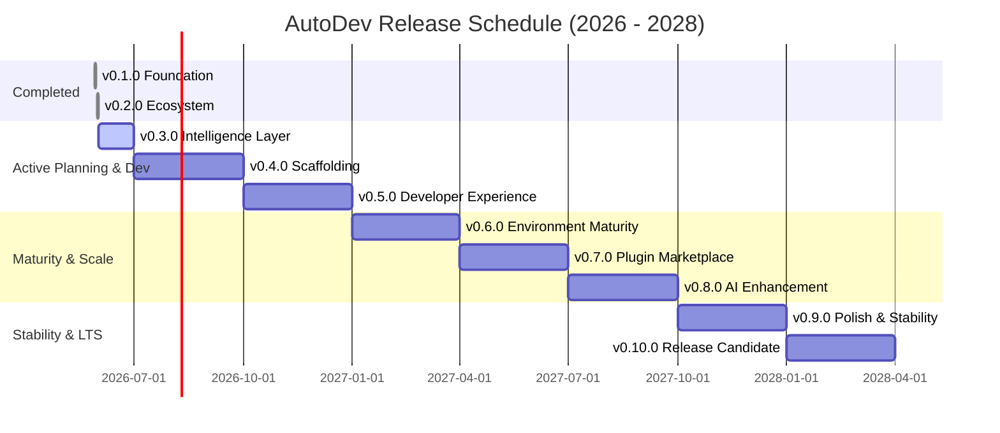
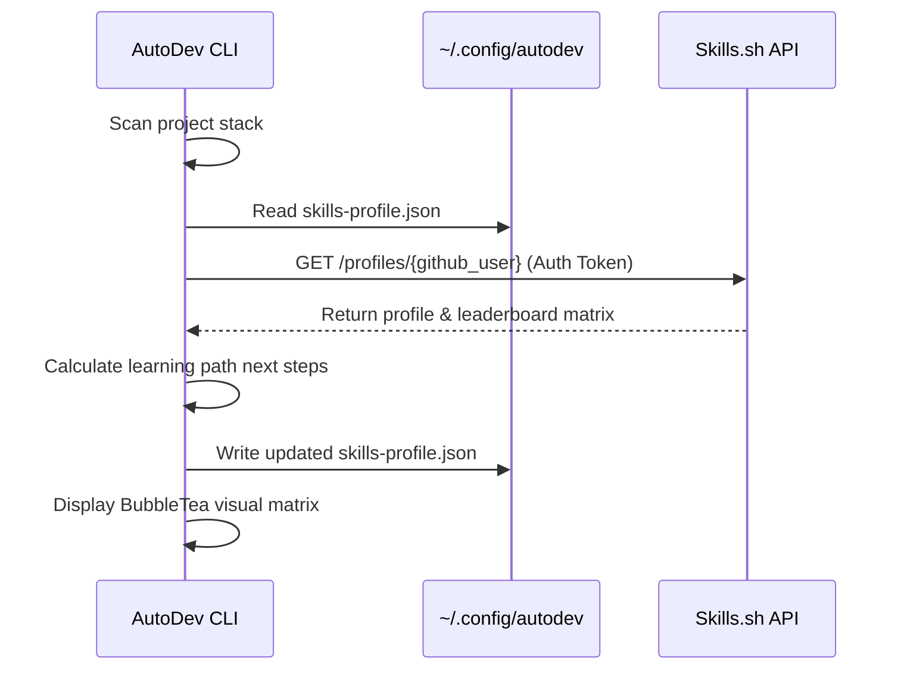

# AutoDev Roadmap & Product Milestones

This document details the completed milestones, the active release, and the future release schedule for AutoDev through **v0.10.0 (Release Candidate)** spanning from **Q3 2026 through Q2 2028**.

---

## 🗺️ Visual Release Timeline



---

## 🛠️ Feasibility Check & Architecture Assessment

- **Implementation Viability**: **High**. AutoDev is written in Go, which produces single, static cross-platform binaries. This makes environment scanning and dependency execution highly performant, portable, and cross-platform.
- **Security & TUI**: BubbleTea (TUI) provides a lightweight terminal experience with no external web dependencies. Sandboxing plugin/package installations is key, which is managed using clear user consent prompts (`--yes` flags) and dry-run outputs.
- **Privacy & Telemetry**: AI diagnostics and self-healing features (`autodev doctor --fix`) run locally first via integration with local LLMs (Ollama). Telemetry is strictly **opt-in**, keeping user code and paths fully private.
- **Skills.sh Integration**: Integrates directly with Vercel's `Skills.sh` API by retrieving learning paths and syncing them via a lightweight JSON model.

---

## 📦 Version History & Milestones

### ✅ v0.1.0 — Foundation (Released 2026-05-29)

- **CLI Core Engine**: Cobra command structuring with basic flags.
- **Polyglot Repo Scanner**: Support for 30+ languages/frameworks.
- **Bootstrap Shell Installer**: `curl | bash` installation script.
- **Reporting**: HTML, JSON, and Markdown generation.
- **Infrastructure**: Go monorepo structure + GitHub Actions CI.

### ✅ v0.2.0 — Ecosystem Expansion (Released 2026-05-31)

- **DevOps & K8s**: Docker, kubectl, and Helm detectors and installers.
- **Mobile SDKs**: Flutter SDK & Android emulator setup tools.
- **JVM & Build Systems**: OpenJDK, Kotlin, and Maven runtimes.
- **Backend Stacks**: PHP, Ruby, Composer, and Bundler.
- **Interactive TUI**: BubbleTea selector for visual roadmap matrices.
- **AI Rules files Auto-generation**: Auto-writing `.autodev-skills.md`, `.cursorrules`, `.clinerules` to save **99.8% of prompt context tokens**.
- **NPM Release**: Published `@heetmehta18/autodev@0.2.0` CLI wrapper package.

---

### ✅ v0.3.0 — Intelligence Layer (Released 2026-06-01)

- **Features:**
  - [x] **AI Dependency Doctor**: `autodev doctor --fix` detects and repairs version mismatches, path issues, compiler errors, and conflicts.
  - [x] **Auto .env Scaffolding**: Automatically creates `.env` files from `.env.example` or structural scan parameters.
  - [x] **Multi-project / Monorepo Scan**: Support for scan and setups across workspaces containing multiple nested projects.
  - [x] **Cloud IDE Scaffolding**: Support for generating DevContainer setups (`autodev containerize` generates `.devcontainer.json`).
  - [x] **Plugin Core (v0)**: Load package-specific detectors and setup instructions defined in YAML manifests.
  - [x] **Environment Lockfile**: Unified `autodev.lock.json` manifest representing environment versions.
- **Integrations:**
  - [x] **Skills.sh (Deep Profile Sync)**: Sync user profile scores with `Skills.sh` API and generate learning path milestones.
  - [x] **VSCode recommends**: Generate `.vscode/extensions.json` containing recommended extension IDs for detected stacks.
- **Breaking Changes & Migrations:**
  - [x] Deprecate JSON configuration profiles in favor of a unified YAML configuration schema.
  - [x] Provide `autodev migrate` to upgrade existing profiles.
- **Testing / CI / Docs:**
  - [x] Add mocked compiler path failure scenarios for `doctor --fix` testing.
  - [x] Verify DevContainer validation checks in CI.
  - [x] Publish YAML Plugin manifest schema documentation.
- **Effort Estimate:** Large.

---

### 🚧 v0.4.0 — Scaffolding & CLI Ecosystem (Target: 2026-10-01)

- **Features:**
  - **DevContainer Generator v1**: Direct Dockerfile + `.devcontainer.json` generation based on scanned telemetry.
  - **CI/CD Template Generator**: `autodev ci` generates GitHub Actions workflow matrix templates for your stack.
  - **Plugin Registry (Beta)**: Command `autodev plugin list` allows searching and installing third-party community plugins.
  - **VSCode Extension**: Release a lightweight editor extension to trigger scans and setup checks.
- **Integrations:**
  - Enable Vercel/Netlify one-click deployment templates.
  - Automatic annotations-to-markdown documentation compiler.
- **Breaking Changes:**
  - Upgrade Plugin API to v1 (manifest mappings change from `dependencies` to `requires`).
- **Testing / CI / Docs:**
  - End-to-end repository scaffolding tests.
  - Publish "Writing Community Plugins" developer manual.
- **Effort Estimate:** Large.

---

### 🚧 v0.5.0 — Interactive CLI UX (Target: 2027-01-01)

- **Features:**
  - **Wizard Installer**: Interactive installer checklists (`autodev interactive`) to select packages.
  - **Local LLM bug diagnosis**: Run local model queries (via Ollama) using `autodev diagnose` to triage compilation errors.
  - **Localization (i18n)**: Begin multi-lingual console messaging (English, Spanish, etc.).
- **Integrations:**
  - Retrieve Vercel's Open Agent Skills matrix directly to recommend learning roadmaps.
  - Newman/Postman API test runner checks.
- **Testing / CI / Docs:**
  - BubbleTea UI layout testing.
  - Mock LLM API testing.
- **Effort Estimate:** Medium.

---

### 🚧 v0.6.0 — Environment Maturity (Target: 2027-04-01)

- **Features:**
  - **Self-Hosted Mirror Mode**: Caching compilers and runtimes for offline / air-gapped corporate environments.
  - **Parallel Runtimes Installation**: Speed up setup using parallel compiler downloads.
  - **Additional Languages**: Support C/C++ compilation toolchains and `.NET` SDK installers.
- **Integrations:**
  - **Nix flakes (Experimental)**: Optional generation of Nix package configurations.
- **Testing / CI / Docs:**
  - Performance benchmark testing under offline simulations.
  - Configure corporate firewall proxy setups guide.
- **Effort Estimate:** Medium.

---

### 🚧 v0.7.0 — Community Marketplace (Target: 2027-07-01)

- **Features:**
  - **Plugin Portal**: Launch `plugins.autodevs.dev` portal mapping third-party community packages.
  - **Official Plugins**: Curate official MySQL, Postgres, Redis, AWS CLI, and Github CLI packages.
  - **Project Bootstrapper**: `autodev create <template>` command to scaffold standard React/Next/Flask boilerplates.
- **Integrations:**
  - **Usage Telemetry (Opt-in)**: Add anonymous telemetry prompts.
- **Testing / CI / Docs:**
  - Audit pipelines for third-party manifest registrations.
- **Effort Estimate:** Large.

---

### 🚧 v0.8.0 — AI Enhancement Layer (Target: 2027-10-01)

- **Features:**
  - **AI Code Assistant**: `autodev ai-gen` command to generate scripts or terminal workflows locally via Ollama or OpenAI.
  - **Redundant Dependency Auditor**: Scans package manifests to flag duplicate or unused libraries.
- **Integrations:**
  - Configure custom LLM api endpoints easily in configs.
- **Testing / CI / Docs:**
  - Evaluate AI suggestion safety policies.
- **Effort Estimate:** Medium.

---

### 🚧 v0.9.0 — Polish & Optimization (Target: 2028-01-01)

- **Features:**
  - **Visual Polish**: Theme configurations for the BubbleTea TUIs.
  - **Security Scanning**: Integrate security checking bots (`snyk`, `npm audit`, `cargo audit`).
  - **Full Internationalization**: Provide translations for Spanish, Chinese, French, and Japanese.
- **Testing / CI / Docs:**
  - Regression suite verification.
- **Effort Estimate:** Medium.

---

### 🚧 v0.10.0 — Release Candidate (Target: 2028-04-01)

- **Features:**
  - **Feature Freeze**: Freeze release parameters to focus on stability.
  - **Enterprise Deployments**: Helm charts and K8s manifests for self-hosted instances.
  - **Production docs**: Launch final developer site.
- **Testing / CI / Docs:**
  - Aim for 100% Go/TUI test coverage.
- **Effort Estimate:** Large.

---

## 💡 Alternatives Analysis & Comparison

| Feature                     | AutoDev ⚡                                | Dev Containers                   | Nix / Devenv                       | Homebrew / Winget                   |
| :-------------------------- | :---------------------------------------- | :------------------------------- | :--------------------------------- | :---------------------------------- |
| **Cross-Platform Installs** | **High** (Single static Go binary)        | Medium (Requires Docker)         | High (WSL on Windows)              | Medium (Platform-specific packages) |
| **Ease of Use**             | **High** (One-click setups, TUI controls) | Medium (Requires Docker configs) | Low (Steep Nix query syntax)       | High (Simple CLI commands)          |
| **Reproducibility**         | **High** (JSON lockfiles + Docker gen)    | High (Container isolation)       | Very High (Pure functional builds) | Medium (Global versions change)     |
| **Offline Support**         | **Good** (Cached toolchain mirrors)       | Medium (Pulls base images)       | Excellent (Binary caches)          | Good (Caches files locally)         |
| **AI / Agent Rules**        | **Yes** (Automated rule generation)       | No                               | No                                 | No                                  |

---

## 🛠️ YAML Package Manifest Specification

Third-party community plugins are defined using a structured YAML package manifest:

```yaml
name: nodejs
version: 20.11.0
description: Node.js JavaScript runtime environment
requires:
  - python3
detect:
  files:
    - package.json
    - tsconfig.json
  executables:
    - node
    - npm
install:
  ubuntu:
    apt:
      - curl
    script:
      - curl -fsSL https://deb.nodesource.com/setup_20.x | bash -
      - apt-get install -y nodejs
  macos:
    brew:
      - node@20
  windows:
    winget:
      - OpenJS.NodeJS.LTS
config:
  env:
    - PATH: "/usr/local/bin:$PATH"
```

---

## 📊 Skills.sh Data Sync Flow



---

## 📝 Release Verification Checklist

- [ ] conventional-commits generated `CHANGELOG.md` notes checked.
- [ ] Bushed version configuration in Go matches release tag.
- [ ] Local units, integrations, and lint checks report 100% green.
- [ ] Cross-platform builds (Linux, macOS, Windows) generated successfully.
- [ ] CLI updater commands verified.
- [ ] Documentation sites updated with the matching version tags.
- [ ] GitHub Actions releases workflow triggered on tag push.
