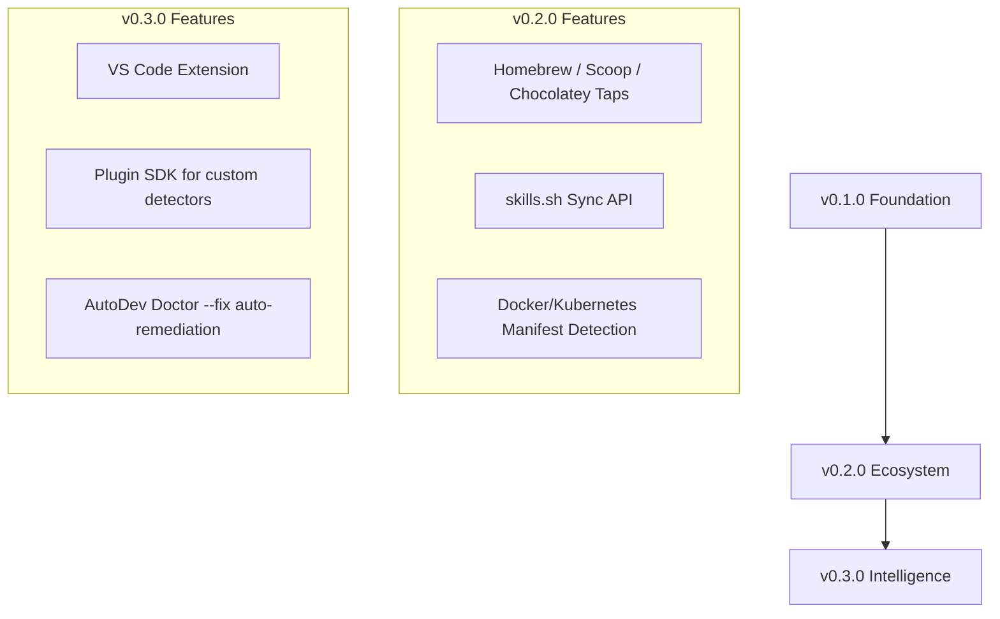

</h1>

```text
  █████╗ ██╗   ██╗████████╗ ██████╗ ██████╗ ███████╗██╗   ██╗
  ██╔══██╗██║   ██║╚══██╔══╝██╔═══██╗██╔══██╗██╔════╝██║   ██║
  ███████║██║   ██║   ██║   ██║   ██║██║  ██║█████╗  ██║   ██║
  ██╔══██║██║   ██║   ██║   ██║   ██║██║  ██║██╔══╝  ╚██╗ ██╔╝
  ██║  ██║╚██████╔╝   ██║   ╚██████╔╝██████╔╝███████╗ ╚████╔╝ 
  ╚═╝  ╚═╝ ╚═════╝    ╚═╝    ╚══════╝ ╚═════╝ ╚══════╝  ╚═══╝ 
```


<p align="center">
  <strong>Clone. Scan. Install. Build.</strong>
</p>

<p align="center">
  An open-source, cross-platform developer environment bootstrapper that automatically detects technologies, installs missing runtimes, dependencies, SDKs, and dev tools — all with a single command.
</p>

<p align="center">
  <a href="https://github.com/HEETMEHTA18/autodev/actions/workflows/ci.yml">
    
  </a>
  <a href="https://github.com/HEETMEHTA18/autodev/releases/latest">
    
  </a>
  <a href="LICENSE">
    
  </a>
  <a href="https://github.com/HEETMEHTA18/autodev/stargazers">
    
  </a>
</p>

---

## Quick Start

```bash
# One-line install
curl -fsSL https://raw.githubusercontent.com/HEETMEHTA18/autodev/main/scripts/install.sh | bash

# Or via NPX
npx autodev setup

# Or via PNPM
pnpm dlx autodev setup

# Or via Homebrew (macOS/Linux)
brew install HEETMEHTA18/tap/autodev

# Or via Scoop (Windows)
scoop install autodev

# Or via Docker
docker run --rm -v $(pwd):/workspace ghcr.io/heetmehta18/autodev setup
```

Then run in any repo:

```bash
autodev setup
```

---

## 🔍 What It Does

| Command | Description |
|---------|-------------|
| `autodev scan` | Scan current repo for languages, frameworks, package managers |
| `autodev setup` | Install all missing runtimes and dependencies |
| `autodev audit` | Audit repository dependencies for security vulnerabilities (OSV.dev) |
| `autodev github <USER>` | Scan all public repos of a GitHub user |
| `autodev doctor` | Check environment health |
| `autodev report` | Generate HTML/PDF/JSON environment report |
| `autodev skills` | Show personalized learning roadmap |
| `autodev install <tool>` | Install a specific runtime or tool |
| `autodev update` | Update all managed runtimes |
| `autodev clean` | Remove cached downloads and temp files |
| `autodev export` | Export environment config as reproducible JSON |

---

## ⚔️ Why AutoDev?

How does AutoDev compare to existing developer tools? Here is the matrix:

| Feature | AutoDev ⚡ | Dev Containers | Nix / Devenv | Homebrew / ASDF |
|:---|:---:|:---:|:---:|:---:|
| **Zero-Config Setup** | **Yes (Automatic)** | No (Requires JSON/Docker) | No (Requires Nix expressions) | No (Manual installs) |
| **Monorepo Polyglot Scan** | **Yes** | No | No | No |
| **Git-History Skill Intelligence** | **Yes** | No | No | No |
| **Interactive Terminal TUI** | **Yes** | No | No | No |
| **Lightweight (No VM/Docker needed)**| **Yes** | No (Requires Docker) | Yes | Yes |

---

## 🤖 Integrations & AI Agent Adoption

AutoDev serves as the local environment automation and telemetry layer for developers and modern **AI agents / Coding Assistants** (like Cursor, Claude Desktop, Windsurf, Cline, and Copilot).

### ⚡ Automatic AI Rule Files & 99.8% Context Saving
Whenever any AutoDev command is run in a project workspace, AutoDev automatically creates/updates standard AI rules files:
*   [`.autodev-skills.md`](.autodev-skills.md) (Unified skills matrix, CLI cheatsheet, and environment telemetry)
*   [`.cursorrules`](.cursorrules) (Cursor AI agent rules)
*   [`.clinerules`](.clinerules) (Cline/Roo-Cline rules)
*   [`.github/copilot-instructions.md`](.github/copilot-instructions.md) (GitHub Copilot instructions)

These rules instruct AI Agents to use AutoDev's telemetry instead of parsing directory structures or lockfiles recursively. This reduces context payloads from **200,000+ tokens to ~350 tokens (a 99.8% token context saving)** per roundtrip.

### Programmatic Usage
AI agents can invoke `autodev` or call its MCP tools to discover, verify, or install dependencies:
- **Environment Discovery:** Run `autodev scan` or call the `autodev_scan` tool to detect languages, frameworks, package managers, and databases.
- **Environment Bootstrapping:** Run `autodev setup --yes` or call the `autodev_install` tool to automatically and hermetically install missing tools.
- **Diagnostics Check:** Run `autodev doctor` or call the `autodev_doctor` tool to verify compiler path health, gitignore setups, and local configurations.
- **Auto-Fixes:** Run `autodev doctor --fix` (or `autodev_doctor` tool with `{"fix": true}`) to automatically repair misconfigured developer toolchains.

---

## 🗺️ Product Roadmap



---

## 🏗️ Project Structure

```
autodev/
├── apps/
│   └── website/          # Next.js 15 marketing site + docs
├── packages/
│   ├── cli/              # Go CLI (cobra + bubbletea)
│   ├── core/             # OS/arch detection, config
│   ├── scanner/          # Repo + GitHub scanner
│   ├── installer/        # Runtime installer
│   ├── skills/           # skills.sh integration
│   └── github/           # GitHub API client
├── scripts/
│   ├── install.sh        # Curl installer
│   └── build.sh          # Build script
├── .github/
│   └── workflows/        # CI/CD pipelines
├── go.work               # Go workspace
├── pnpm-workspace.yaml   # PNPM workspaces
└── turbo.json            # Turborepo config
```

---

## 🤝 Contributing

We welcome contributions of all kinds! Please read [CONTRIBUTING.md](CONTRIBUTING.md) to get started.

- 🐛 [Report a Bug](https://github.com/HEETMEHTA18/autodev/issues/new?template=bug_report.md)
- 💡 [Request a Feature](https://github.com/HEETMEHTA18/autodev/issues/new?template=feature_request.md)
- 📖 [Improve Docs](https://github.com/HEETMEHTA18/autodev/tree/main/apps/website)

---

## 📜 License

MIT © [AutoDev Contributors](https://github.com/HEETMEHTA18/autodev/graphs/contributors)
